# Basic Burger Ordering Chatbot with Watson Assistant Service

In this repo, you are going to use the basic Watson Assistant features to build a chatbot for ordering burgers, drinks and etc. By having a casual conversation, Watson Natural Language Understanding(NLU) and Watson Natural Language Processing(NLP) capabilities embeded in Watson Assistant service help you effectively understand what your customer want to order, such as type of burgers, size of drinks, dine-in or to-go, and so on.

You can have a simple chatbot up and running in no time. When you access the chatbot on a mobile device, the built-in voice input supports verbal data entry which can greatly enhance the user experience.

After you complete the exercise, you will understand how to:

* Build Watson Assistant components
    - Intents
    - Entities
    - Dialog
* Create a simple chatbot that can be deployed locally, in IBM Clod Foundry, IBM Kubernetes Service and OpenShift.
* Via this simple chatbot, you can exchange information similar to text messaging.

This repo is part of Watson chatbot serial. The entire serial includes
* Simple ChatBot
* Dressed-up ChatBot
* Voice-Enabled ChatBot
* VoiceBot – Call and speak to ChatBot

> **NOTE**: Watson Assistant service is available in IBM Cloud as well as part of IBM Cloud pak for Data. As the result, you can deploy and run your chatbot in public cloud, private cloud, hybird cloud and on-prem.

> Click [here](https://www.ibm.com/products/cloud-pak-for-data) for more information about IBM Cloud Pak for Data.

Adopted from IBM code pattern [Creating a pizza ordering chatbot using Watson Assistant slots feature](https://github.com/IBM/watson-assistant-slots-intro).


## Use Case Flow

1. User sends messages to the application (running locally or on IBM Cloud).
2. The application sends the user message to IBM Watson Assistant service, and displays the ongoing chat in a web page.
3. Watson Assistant uses the NLU and NLP to understand and fulfill your order, and sends requests for additional information back to the running application. Watson Assistant can be provisioned on either IBM Cloud or IBM Cloud Pak for Data.


## Included Components

* [IBM Watson Assistant](https://www.ibm.com/cloud/watson-assistant/): Build, test and deploy a bot or virtual agent across mobile devices, messaging platforms, or even on a physical robot.


## Featured technologies

* [Node.js](https://nodejs.org/): An asynchronous event driven JavaScript runtime, designed to build scalable applications.

## Exercise Flow

### Step 1 - Deploying a Sample Application

To deploy a sample application showing how to use `Watson Assistant` APIs,

<!--
|   |   |   |   |
| - | - | - | - |
| [](doc/source/cf.md) | [](doc/source/iks.md) | [](doc/source/openshift.md) | [](doc/source/local.md) |
-->

|   |   |   |   |
| - | - | - | - |
|  |  |  | [](doc/source/local.md) |


### Step 2 - Creating an Assistant

The `assistant` is a fully hosted chatbot that is managed by IBM Cloud. It frees you from worrying about deploying and maintaining infrastructure to support the bot. It prrovides an alternative to host a chatbot without any programming.

An assistant is a cognitive bot that you can customize for your business needs, and deploy across multiple channels to bring help to your customers where and when they need it. Skills An assistant routes your customer queries to a skill, which then provides the appropriate response. 

#### Dialog skill

A `dialog skill` can understand and address questions or requests that your customers typically need help with. You provide information about the subjects or tasks your users ask about, and how they ask about them, and the product dynamically builds a machine learning model that is tailored to understand the same and similar user requests.

A sample burger-ordering `dialog skill` was imported to your `Watson Assistant` service instance when you deployed and run the sample application locally.

#### Search skill

A search skill leverages information from existing corporate knowledge bases or other collections of content authored by subject matter experts to address unanticipated or more nuanced customer inquiries.

>Note: Search skill is available to Plus or Premiums plan only.

#### Creating an Assistant

To create an `assistant`,

1. Login to [IBM Cloud](https://cloud.ibm.com).

1. On the dashboard, find and open your `Watson Assistant` service instance.

1. Click `Launch Watson Assistant` on the `Manage` tab.

1. Select the `Assistants` tab in the left navigation tab.

1. Click `Create assistant`.

1. Enter a name, for example `Burger-Simple`.

1. Make sure that the `Enable the preview` checkbox is selected.

1. Click `Create assistant`.

1. Select `Add dialog skill`.

1. Select `watson-burger-simple` skill.

    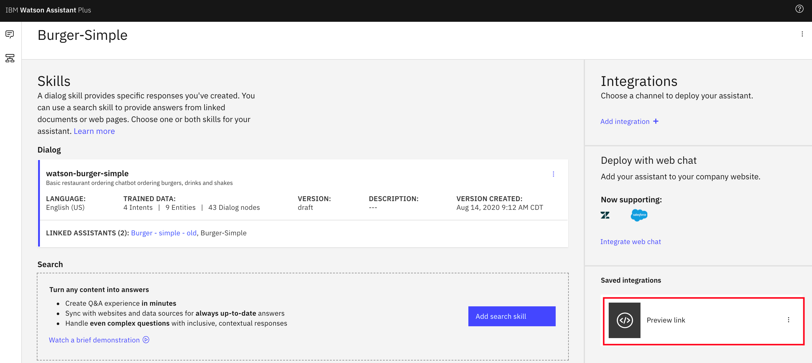

1. Click `Preview link`.

    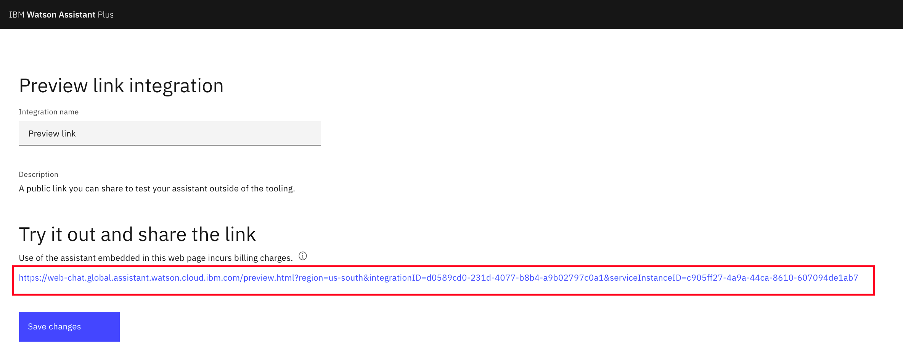

1. Click the link under the section `Try it out and share the link` to show the chatbot on a sample web site.

    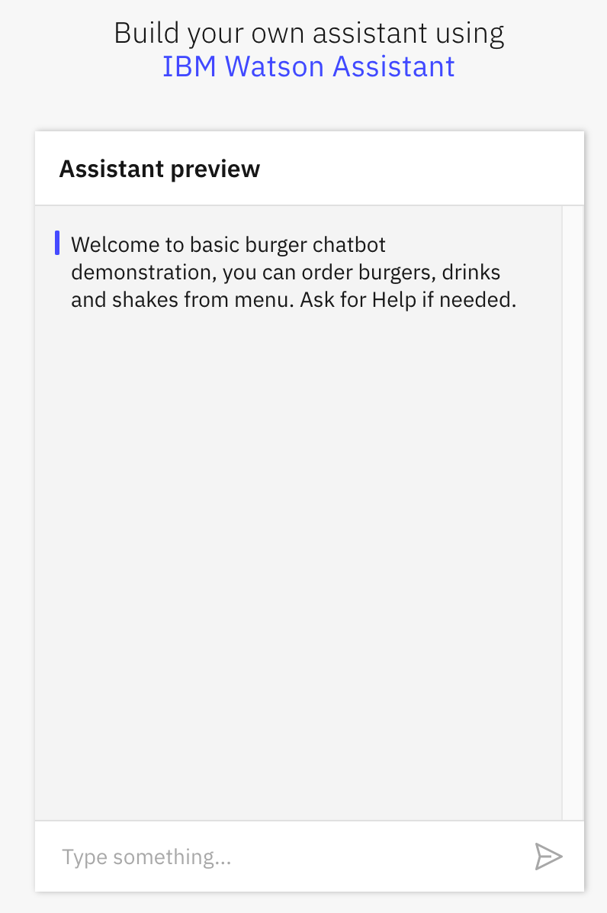

1. You should have a chatbot similar to the one when you tested in the sample application. Communicate with the chatbot and place orders. It works the same.


### Step 3 - Access the Chatbot from Existing Web Site

Add your assistant to your company website as a web chat widget that can help your customers with common questions and tasks, and can transfer customers to human agents.

When you create a web chat integration, code is generated that calls a script that is written in JavaScript. The script instantiates a unique instance of your assistant. You can then copy and paste the HTML script element into any page or pages on your website where you want users to be able to ask your assistant for help.

>Note: This integration is available to Plus or Premium plan users only.

1. Login to [IBM Cloud](https://cloud.ibm.com).

1. On the dashboard, find and open your `Watson Assistant` service instance.

1. Click `Launch Watson Assistant` on the `Manage` tab.

1. Select the `Assistants` tab in the left navigation tab.

1. Select `Burger-Simple`.

    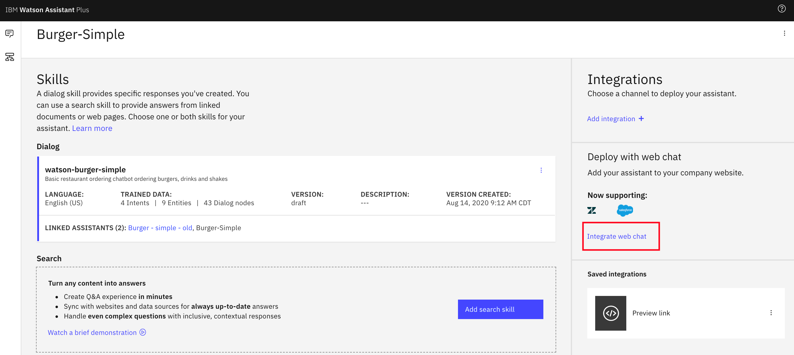

1. Click `Integrated web chat` link.

1. Click `Create`.

1. Navigate to `Embed` tab.

    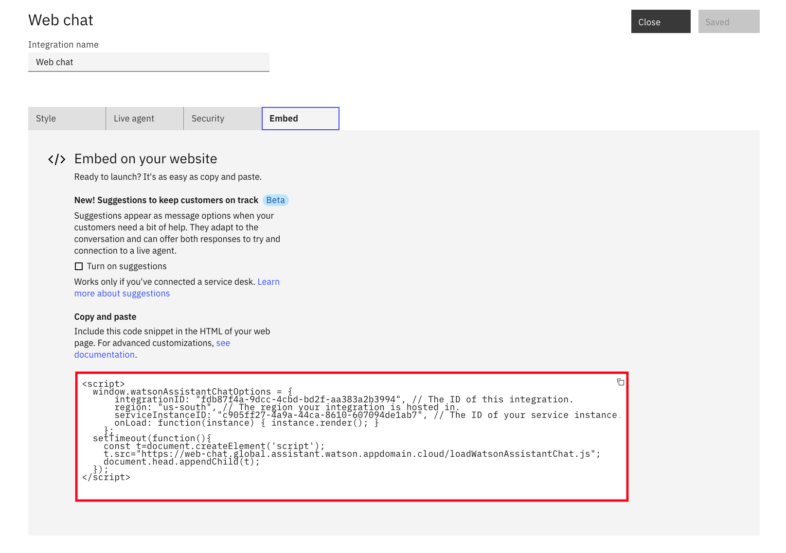

1. When you create a web chat integration, code is generated that calls a script that is written in JavaScript. The script instantiates a unique instance of your assistant. You can then copy and paste the HTML script element into any page or pages on your website where you want users to be able to ask your assistant for help.

1. Copy the script.

1. Open file `sample_homepage.html` in a file editor. The file locates in the root folder of the downloaded repo. This sample HTML file is used to similate a company web page.

1. Past the script under the section `<!-- copied script elements -->`. 

    ```
    <html>
    <head>My web site</head>
        <body>
            <title>My Test Page</title>
            <H1>Welcome to my home page</H1> 
            <!-- <p>Welcome to my home page</p> -->
            
            <!-- copied script elements -->
            <script>
                window.watsonAssistantChatOptions = {
                    integrationID: "fdb87f4a-9dcc-4cbd-bd2f-aa383a2b3994", // The ID of this integration.
                    region: "us-south", // The region your integration is hosted in.
                    serviceInstanceID: "c905ff27-4a9a-44ca-8610-607094de1ab7", // The ID of your service instance.
                    onLoad: function(instance) { instance.render(); }
                };
                setTimeout(function(){
                const t=document.createElement('script');
                t.src="https://web-chat.global.assistant.watson.appdomain.cloud/loadWatsonAssistantChat.js";
                document.head.appendChild(t);
                });
            </script>        

        </body>
    </html>

    ```

1. Save the changes.

1. Open the file `sample_homepage.html` in a browser.

1. The chatbot widget is embeded at the bottom-right corner of the web page.

    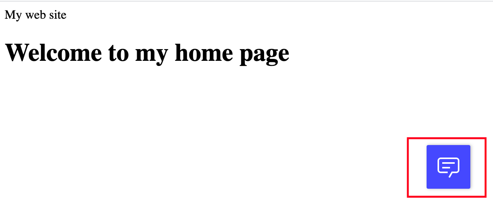

1. The chatbot widget is expanded when you click on it. The chatbot window appears on the web page.


### Step 4 - Modifying the Sample Dialog Skills

A sample burger-ordering `dialog skill` was imported to your `Watson Assistant` service instance when you deployed and run the sample application locally. In this section, you are going to modify the sample skill slightly to help you understand how the chatbot works.

The natural-language processing for the Watson Assistant service is defined in a dialog skill, which is a container for all of the artifacts that define a conversation flow.

#### 4.1 Intents

Intents are purposes or goals that are expressed in a customer's input, such as answering a question or processing a bill payment. By recognizing the intent expressed in a customer's input, the Watson Assistant service can choose the correct dialog flow for responding to it.

##### 4.1.1 Plan the intents for your application.

Consider what your customers might want to do, and what you want your application to be able to handle on their behalf. For example, you might want your application to help your customers make a purchase. If so, you can add a #buy_something intent. (The # that is added as a prefix to the intent name helps to clearly identify it as an intent.)

##### 4.1.2 Teach Watson about your intents.

After you decide which business requests that you want your application to handle for your customers, you must teach Watson about them. For each business goal (such as #buy_something), you must provide at least 5 examples of utterances that your customers typically use to indicate their goal. For example, I want to make a purchase.

Ideally, find real-world user utterance examples that you can extract from existing business processes. The user examples should be tailored to your specific business. For example, if you are an insurance company, a user example might look more like this, I want to buy a new XYZ insurance plan.

The examples that you provide are used by your assistant to build a machine learning model that can recognize the same and similar types of utterances and map them to the appropriate intent.

`intent` is verb in a natural language analogy.

##### 4.1.3 Adding utterance to #order intent

To add utterance to `#order` intent,

1. Login to [IBM Cloud](https://cloud.ibm.com).

1. On the dashboard, find and open your `Watson Assistant` service instance.

1. Click `Launch Watson Assistant` on the `Manage` tab.

1. Select the `Skills` tab in the left navigation tab.

1. Select `watson-burger-simple` tile.

1. `Intents` is selected by default.

1. Select `#order` intent on the right.

1. Enter `I like to have a cheeseburger` in the `User example` field.

   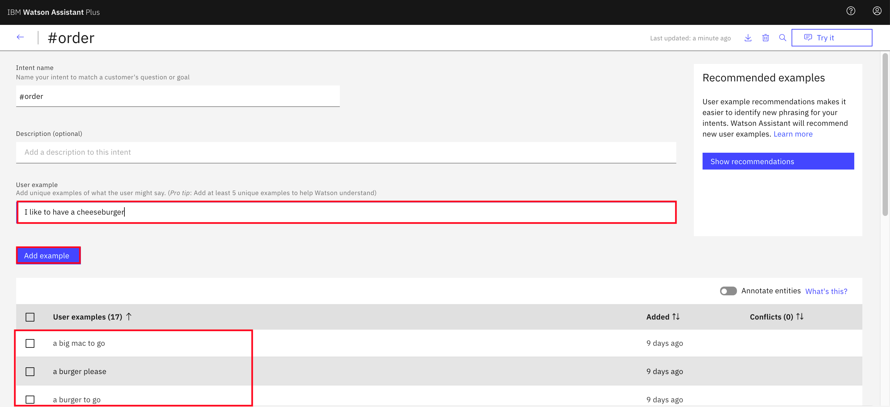

1. Click `Add example`. 

`watson-burger-simple` was developed as a basic skill to order burgers, drinks and etc. `#order` is the main `intent` along with the typical house-keeping intents, `#exit`, `#help` and `#reset`.

You can add as many utterance examples as you like, but minimal 5 examples. In this skill design, the objective is to catch the `#order` intent as well as to identify the food category, such as burger, drink, shake and so on. The utterance examples are provided to meet the objective.

You may redesign the skill if you like to implement it differently.

#### 4.2 entities

Entities represent information in the user input that is relevant to the user's purpose.

If intents represent verbs (the action a user wants to do), entities represent nouns (the object of, or the context for, that action). For example, when the intent is to get a weather forecast, the relevant location and date entities are required before the application can return an accurate forecast.

Recognizing entities in the user's input helps you to craft more useful, targeted responses. For example, you might have a #buy_something intent. When a user makes a request that triggers the #buy_something intent, the assistant's response should reflect an understanding of what the something is that the customer wants to buy. You can add a @product entity, and then use it to extract information from the user input about the product that the customer is interested in. (The @ prepended to the entity name helps to clearly identify it as an entity.)

You can add multiple responses to your dialog tree with wording that differs based on the @product value that is detected in the user's request.

`entity` is noun in a natural language analogy.

##### 4.2.1 Dictionary-based method

Your assistant looks for terms in the user input that match the values, synonyms, or patterns you define for the entity.

* Synonym entity: You define a category of terms as an entity (color), and then one or more values in that category (blue). For each value you specify a bunch of synonyms (aqua, navy). You can also pick synonyms to add from recommendations made to you by Watson.

    At run time, your assistant recognizes terms in the user input that exactly match the values or synonyms that you defined for the entity as mentions of that entity.

* Pattern entity: You define a category of terms as an entity (contact_info), and then one or more values in that category (email). For each value, you specify a regular expression that defines the textual pattern of mentions of that value type. For an email entity value, you might want to specify a regular expression that defines a text@text.com pattern.

    At run time, your assistant looks for patterns matching your regular expression in the user input, and identifies any matches as mentions of that entity.

* System entity: Synonym entities that are prebuilt for you by IBM. They cover commonly used categories, such as numbers, dates, and times. You simply enable a system entity to start using it.

##### 4.2.2 Annotation-based method

When you define an annotation-based entity, which is also referred to as a contextual entity, a model is trained on both the annotated term and the context in which the term is used in the sentence you annotate. This new contextual entity model enables your assistant to calculate a confidence score that identifies how likely a word or phrase is to be an instance of an entity, based on how it is used in the user input.

* Contextual entity: First, you define a category of terms as an entity (product). Next, you go to the Intents page and mine your existing intent user examples to find any mentions of the entity, and label them as such. For example, you might go to the #buy_something intent, and find a user example that says, I want to buy a Coach bag. You can label Coach bag as a mention of the @product entity.

    For training purposes, the term you annotated, Coach bag, is added as a value of the @product entity.

    At run time, your assistant evaluates terms based on the context in which they are used in the sentence only. If the structure of a user request that mentions the term matches the structure of an intent user example in which a mention is labeled, then your assistant interprets the term to be a mention of that entity type. For example, the user input might include the utterance, I want to buy a Gucci bag. Due to the similarity of the structure of this sentence to the user example that you annotated (I want to buy a Coach bag), your assistant recognizes Gucci bag as a @product entity mention.

    When a contextual entity model is used for an entity, your assistant does not look for exact text or pattern matches for the entity in the user input, but focuses instead on the context of the sentence in which the entity is mentioned.

    If you choose to define entity values by using annotations, add at least 10 annotations per entity to give the contextual entity model enough data to be reliable.

##### 4.2.3 Modifying Entity @beverage

To modify entity `@beverage`,

1. Login to [IBM Cloud](https://cloud.ibm.com).

1. On the dashboard, find and open your `Watson Assistant` service instance.

1. Click `Launch Watson Assistant` on the `Manage` tab.

1. Select the `Skills` tab in the left navigation tab.

1. Select `watson-burger-simple` tile.

1. Select `Entities` in the left navigation pane.

1. Select `@beverage` in the right window.

1. Enter `milk` in the `value` field.

1. Enter `low fat milk` in the `Synonyms` field.

1. Optionally, you can add additional synonyms.

   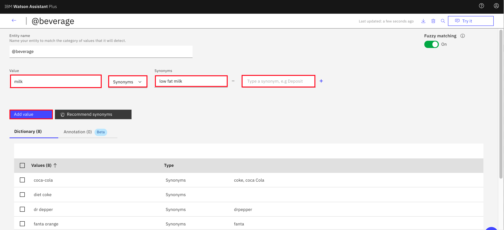

1. Click `Add value`.

Skill `watson-burger-simple` was designed to process orders in two phases. In the initial phase, it catches the user `intent` and also identifies food category. 

In the next phase, the chatbot collects information for individual food category via different dialog path. In the above `entity` example, it works to identify the drink type

`Entity` helps identify all required information until you are ready to complete an order. In the drink example, entity `@beverage` helps identify drink type information, and entity `@mac_size` helps identify drink size information. You can have additional `entity` to collect other information.

#### 4.3 Dialog

The dialog uses the intents that are identified in the user's input, plus context from the application, to interact with the user and ultimately provide a useful response.

The dialog matches intents (what users say) to responses (what the bot says back). The response might be the answer to a question such as Where can I get some gas? or the execution of a command, such as turning on the radio. The intent and entity might be enough information to identify the correct response, or the dialog might ask the user for more input that is needed to respond correctly. For example, if a user asks, Where can I get some food? you might want to clarify whether they want a restaurant or a grocery store, to dine in or take out, and so on. You can ask for more details in a text response and create one or more child nodes to process the new input.

The dialog is represented graphically in Watson Assistant as a tree. Create a branch to process each intent that you want your conversation to handle. A branch is composed of multiple nodes.

##### 4.3.1 Dialog nodes

Each dialog node contains, at a minimum, a condition and a response.

* Condition: Specifies the information that must be present in the user input for this node in the dialog to be triggered. The information is typically a specific intent. It might also be an entity type, an entity value, or a context variable value. See Conditions for more information.

* Response: The utterance that your assistant uses to respond to the user. The response can also be configured to show an image or a list of options, or to trigger programmatic actions. See Responses for more information.

You can think of the node as having an if/then construction: if this condition is true, then return this response.

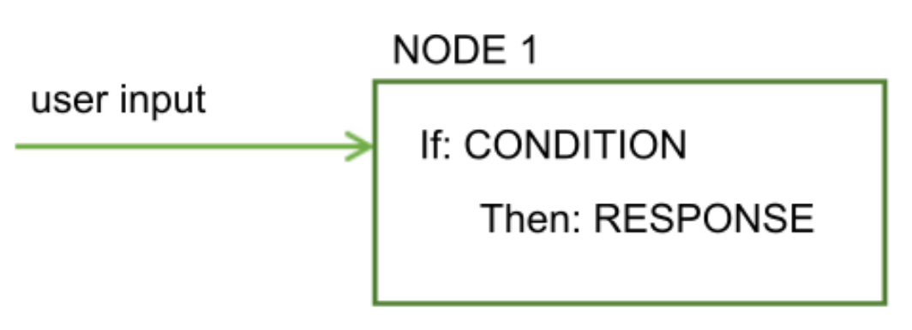

##### 4.3.2 Dialog flow

The dialog that you create is processed by your assistant from the first node in the tree to the last.

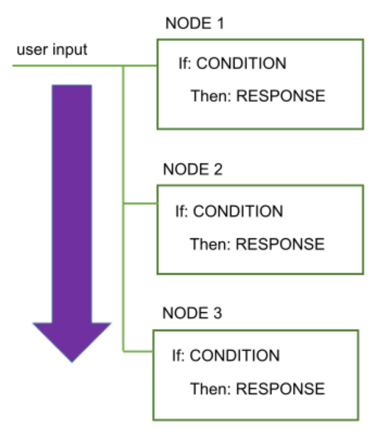    

As it travels down the tree, if your assistant finds a condition that is met, it triggers that node. It then moves along the triggered node to check the user input against any child node conditions. As it checks the child nodes it moves again from the first child node to the last.

Your assistant continues to work its way through the dialog tree from first to last node, along each triggered node, then from first to last child node, and along each triggered child node until it reaches the last node in the branch it is following.

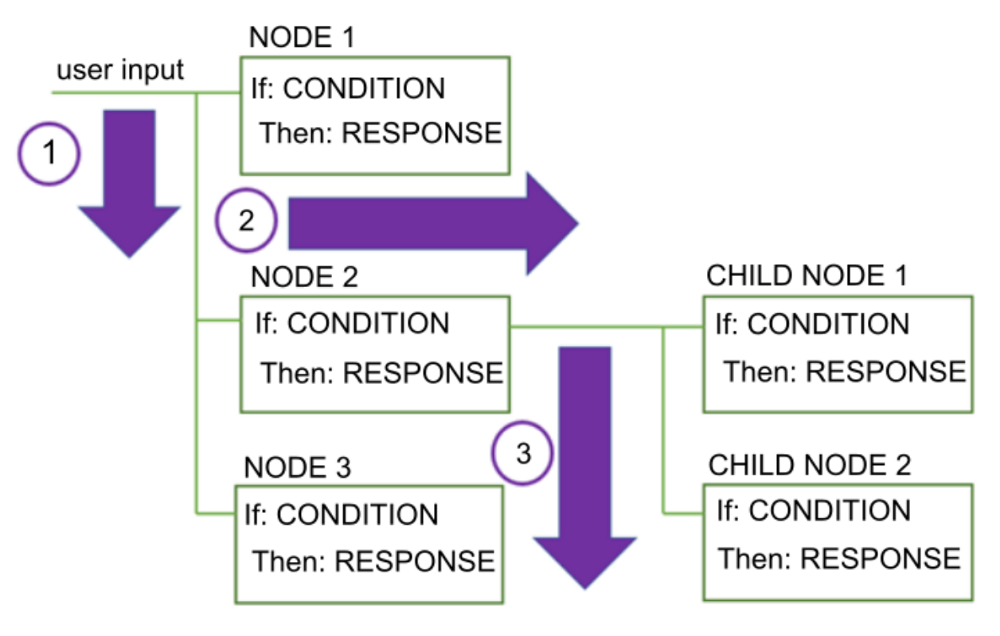    

When you start to build the dialog, you must determine the branches to include, and where to place them. The order of the branches is important because nodes are evaluated from first to last. The first root node whose condition matches the input is used; any nodes that come later in the tree are not triggered.

When your assistant reaches the end of a branch, or cannot find a condition that evaluates to true from the current set of child nodes it is evaluating, it jumps back out to the base of the tree. And once again, your assistant processes the root nodes from first to the last. If none of the conditions evaluates to true, then the response from the last node in the tree, which typically has a special anything_else condition that always evaluates to true, is returned.

You can disrupt the standard first-to-last flow in the following ways:

* By customizing what happens after a node is processed. For example, you can configure a node to jump directly to another node after it is processed, even if the other node is positioned earlier in the tree. 

* By configuring conditional responses to jump to other nodes. 

* By configuring digression settings for dialog nodes. Digressions can also impact how users move through the nodes at run time. If you enable digressions away from most nodes and configure returns, users can jump from one node to another and back again more easily. 

##### 4.3.3 Exploring Dialog Flow of Skill watson-burger-simple

The dialog flow of `watson-burger-simple` skill has 4 root nodes that match their condition to the 4 `intents` that you defined in the skill. When the chatbot catches your intent through a conversation, it continues the comversation via one of the node branches.

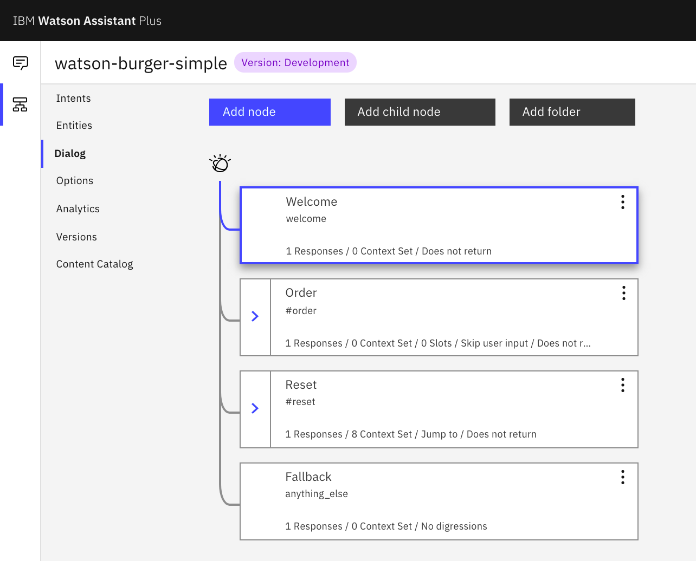

Since `watson-burger-simple` skill is designed for food ordering, most of actions are defined in `Order` node branch. The other 3 root nodes do not have child.

Select the `Order` node, its properies show up in the pop-up wiindow on the right. The chatbot enters this node only when it identifies `@order` intent.

Expand the `Order` node branch. It has 5 child nodes.

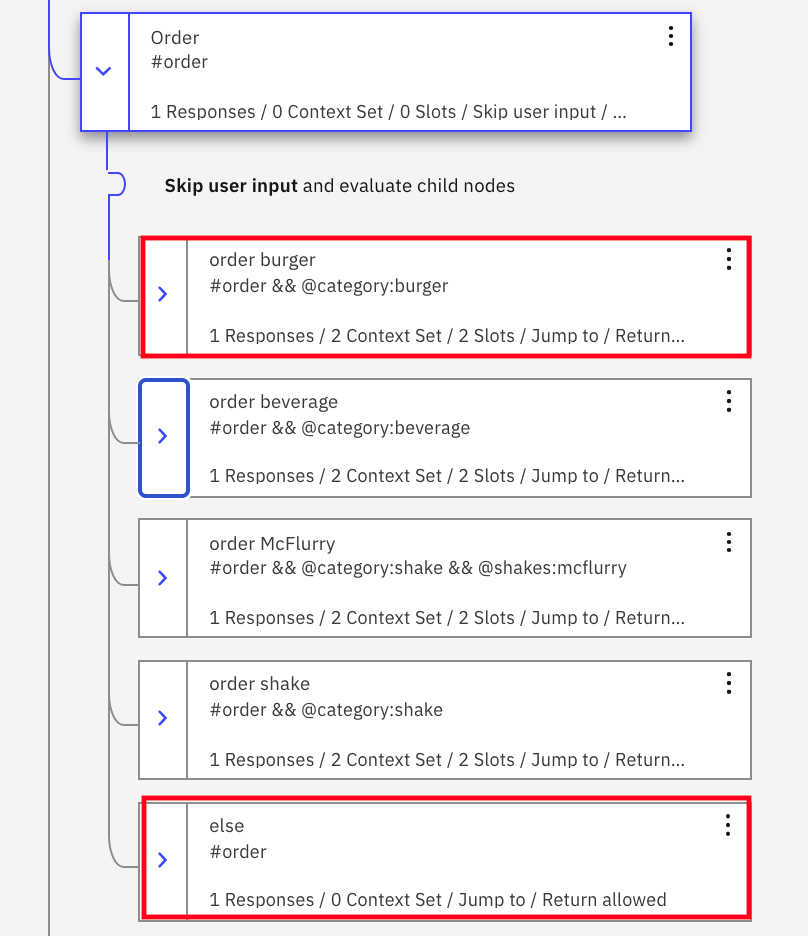

Select the `else` child node. As the node label indicates, this is a catch-all node. Just like the `else` in a `if else` statement. If the condition does not satify all nodes above, the flow will reach this node. 

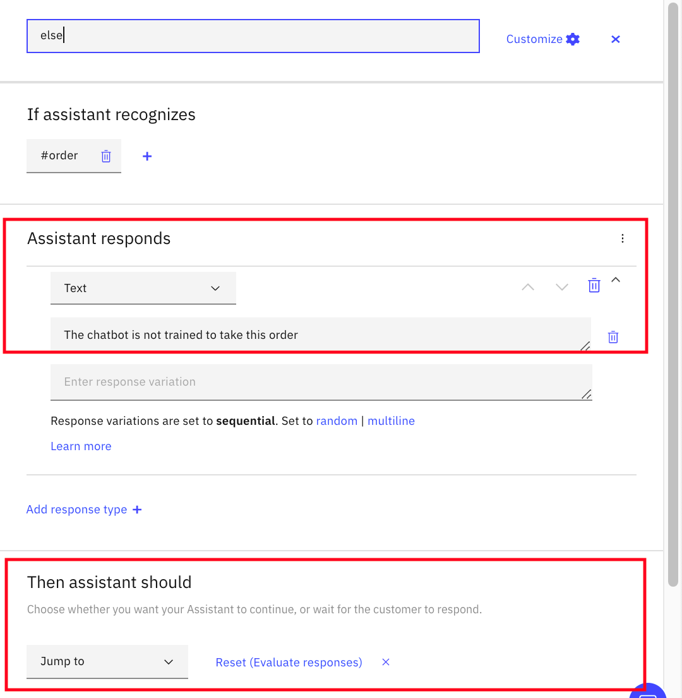

The `else` node response with message `The chatbot is not trained to take this order` and then jumps to the `reset` root node which clears the environment context and then jumps to the `welcome` root node to start over.

Select `order burger` child node. Its properies show up in the pop-up wiindow on the right.


In order to have the `order burger` child node triggered, two condition must be met.
* Intent is `#order`
* Entity `@category` is `burger`

The child node collects two pieces of information.
* Entity `@burger` which is used to identify the burger type
* Entity `@mac_place` which is used to identify the dining location, dine-in or to-go.

To help reduce the number of nodes, two slots are used to collect both inforrmation on a single node. Without using slots, two nodes would be required to collect two pieces of information.

Click the `configuration` icon to the right of `@burger` to open its slot property.


It checks if the entity `@burger` has `burger type` information. If the information is not available, the chatbot will prompt user with message `What type of burger do you want (big mac, cheeseburger, double cheeseburger and etc)?`. When the entity `@burger` has `burger type` information, it stores data in context variable `$mac_burger`.

The second slot works similarly. It checks if the entity `@mac_place` has `dining location` information. If the information is not available, the chatbot will prompt user with message `Is this for dine in or to go?`. When the entity `@mac_place` has `dining location` information, it stores data in context variable `$mac_place`.

When both entity `$mac_burger` and `$mac_place` are populated, you have the burger type as well as dining location information. At this time, you can complete the order. The chatbot displays message `Enjoy your $mac_burger. We are preparing your $mac_place order`. Note, context variable `$mac_burger` and `$mac_place` are used for meaningful message in the current context.

When you develop an application that combines a chatbot and order processing, at this point you can pass both context variables `$mac_burger` and `$mac_place` to your order processing module of your application. Of course, a real food ordering application will require and collect additional information. But, the same principle applies. The sample application embedded in the repo sheds light on how you may develop an application taking advantage of Watson chatbot.

When the `order burger` child node reaches its end, it'll move to the following child node if you don't do anything. Because the current order has completed, you like to reset the environment context and be ready to take the next order. So, the last configuration of the `order burger` child node is to `Jumps to` the `reset` root node which clears the environment context and then jumps to the `welcome` root node to start over.

##### 4.3.4 Try it

So far, you have tested the chatbot via a sample Node.js application and `assistant` preview (a fully hosted chatbot that is managed by IBM Cloud). In this section, you test the chatbot via `Try it` link which is an integrated component of Watson Assistant development environment in IBM Cloud.

`Try it` provides a quick testing option while you develop a skill.

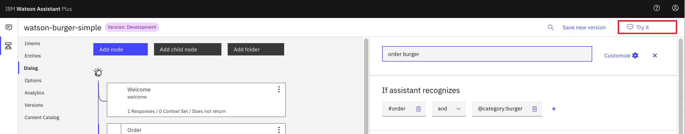

To test the chatbot via `try it` link,

1. Login to [IBM Cloud](https://cloud.ibm.com).

1. On the dashboard, find and open your `Watson Assistant` service instance.

1. Click `Launch Watson Assistant` on the `Manage` tab.

1. Select the `Skills` tab in the left navigation tab.

1. Select `watson-burger-simple` tile to open it.

1. Click `Try it` link.

1. "Try it out` window open on the right. You should be familar to the chatbot UI now.

1. Order a cheeseburger by entering `have a cheeseburger to go`.

    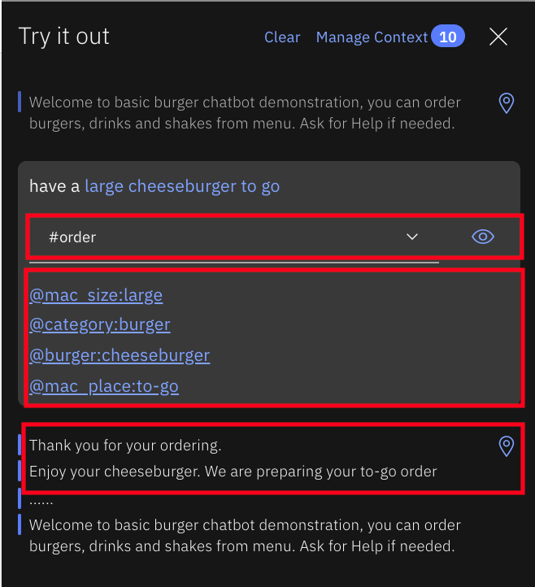

1. If you recall, ordering a burger requires `both burger` type and `dining location`. Since you provided both information when you make order, the chatbot grab both information and complete the order. It displays message `Enjoy your cheeseburger. We are preparing your to-go order`. 

10. The `intent` and `entity` iinformation in the current context are available on the `Try it` UI. As the above screen shot shows, the chatbot identified
* `#order` as intent
* entity `@category` as `burger`. This entity identifies `food category`.
* entity `@burger` as `cheeseburger`. This entity identifies `burger type`.
* entity `@mac_place` as `to-go`. This entity identified `dining location`.


## License

This code pattern is licensed under the Apache Software License, Version 2.  Separate third party code objects invoked within this code pattern are licensed by their respective providers pursuant to their own separate licenses. Contributions are subject to the [Developer Certificate of Origin, Version 1.1 (DCO)](https://developercertificate.org/) and the [Apache Software License, Version 2](https://www.apache.org/licenses/LICENSE-2.0.txt).

[Apache Software License (ASL) FAQ](https://www.apache.org/foundation/license-faq.html#WhatDoesItMEAN)

## Links

* [Demo on youtube](https://youtu.be/6QlAnqSiWvo)
* [IBM Watson Assistant Docs](https://cloud.ibm.com/docs/services/conversation/dialog-build.html#dialog-build)
* [Blog for IBM Watson Assistant Slots Code Pattern](https://developer.ibm.com/code/2017/09/19/managing-resources-efficiently-watson-conversation-slots/)

## Learn more

* **Artificial Intelligence Code Patterns**: Enjoyed this Code Pattern? Check out our other [AI Code Patterns](https://developer.ibm.com/technologies/artificial-intelligence/).
* **AI and Data Code Pattern Playlist**: Bookmark our [playlist](https://www.youtube.com/playlist?list=PLzUbsvIyrNfknNewObx5N7uGZ5FKH0Fde) with all of our Code Pattern videos
* **With Watson**: Want to take your Watson app to the next level? Looking to utilize Watson Brand assets? [Join the With Watson program](https://www.ibm.com/watson/with-watson/) to leverage exclusive brand, marketing, and tech resources to amplify and accelerate your Watson embedded commercial solution.
* **Kubernetes on IBM Cloud**: Deliver your apps with the combined the power of [Kubernetes and Docker on IBM Cloud](https://www.ibm.com/cloud/container-service)
